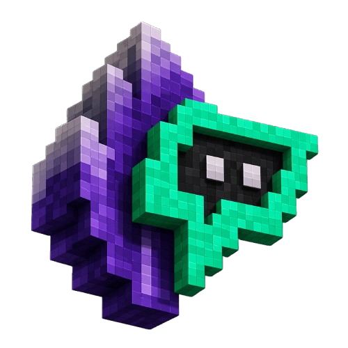

# Obsidialith

<p align="center">
  
</p>

Turn Obsidian into an agentic execution environment where AI systems manage knowledge, projects, and workflows collaboratively.

Obsidialith is a framework that adds a structural and agentic layer to your Obsidian vault. It utilizes a council of specialized AI agents to automate tasks directly within your files.

---

## Core Features

- Multi-Agent Orchestration: Coordinate nine specialized agents to automate different domains of your work.
- MCP Integration: Agents use the Model Context Protocol to access the web, GitHub, and local system tools.
- Visual Strategy: Mandatory use of Obsidian Canvas to map project architecture before implementation.
- Automated Knowledge Linking: Insights from active projects are automatically promoted to a global knowledge network.
- Standardized Protocols: Built-in rules for session logging and vault hygiene.
- Privacy-First: All operations and data remain within your local markdown files.

---

## Prerequisites

- Obsidian: Installed and open.
- Gemini CLI: Installed on your system.
- Obsidian Local REST API Plugin: Installed and enabled.

---

## Option 1: Automated Setup (Recommended)

1. Clone this repository into your Obsidian vault directory:
   ```bash
   git clone https://github.com/notdevank/Obsidialith.git
   ```
2. Run the initialization command:
   ```bash
   gemini "Initialize the system using the protocol in System/Protocols/Setup.md"
   ```
   *The agent will verify your plugins, set up your .env and settings.json files, and validate your tools. It can take some time and may get stuck so please restart the installation in that case*

---

## Option 2: Manual Setup

1. Clone this repository:
   ```bash
   git clone https://github.com/notdevank/Obsidialith.git
   ```
2. Set up environment:
   ```bash
   cp .env.example .env
   # Add your API keys (Gemini, Firecrawl, GitHub) to .env
   ```
3. Configure agents:
   ```bash
   cp .gemini/settings.json.example .gemini/settings.json
   # Update paths to your local MCP servers in settings.json
   ```
4. Verify skills:
   ```bash
   gemini --list-tools
   ```

---

## The Agent Council

The system is managed by specialized agents, each with a dedicated technical toolkit (MCP) and mandate.

| Agent | Role | Focus |
| :--- | :--- | :--- |
| Gene | Architect | Vault structure, MOC management, and architectural integrity. |
| Tetra | Researcher | Deep discovery, web extraction, and conceptual synthesis. |
| Rumi | Catalyst | Growth, marketing, content engine, and audience resonance. |
| Ralph | Engineer | Implementation, technical troubleshooting, and infrastructure. |
| Iola | Creative | UI/UX design, visual identity, and creative direction. |
| Echo | Operator | Automation, DevOps, and performance monitoring. |
| Fiona | Visionary | Product strategy, value proposition, and roadmapping. |
| Atlas | Strategist | Personal growth, scheduling, and accountability. |
| Vulture | Analyst | Financial analysis, market research, and legal-economic strategy. |

---

## System Structure

- Inbox: Entry point for raw captures and data.
- Active: Where ongoing projects and work-streams live.
- Nexus: Permanent, linked knowledge base.
- NCore: Logic and instructions for the agent council.
- System: Infrastructure, templates, and automation scripts.

---

## License
MIT License - Copyright (c) 2026 The Obsidialith Authors.
